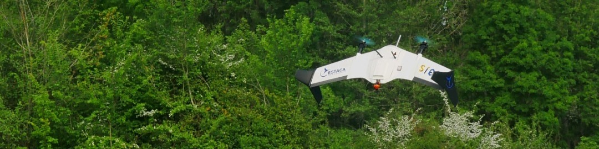

Extract the rar file to get the parts and open the assembly using solidworks 2024 or more recent.

"model2.slx" is the complete 2d (pitch axis) simulation model of the tail sitter with aerodynamic effect.

**1st place to the contest**
****************
Image: Automated Vertical Take-off

  

